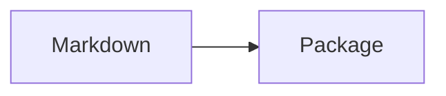

# Static visuals



```vega-lite
{"data":{"values":[{"category":"A","value":3}]},"mark":"bar","encoding":{"x":{"field":"category","type":"nominal"},"y":{"field":"value","type":"quantitative"}}}
```

The fenced sources remain editable text when a preview is unavailable.
